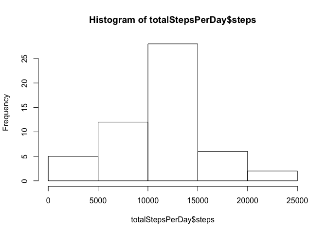
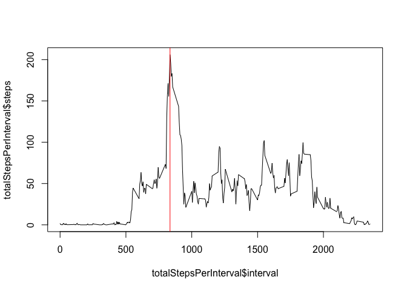
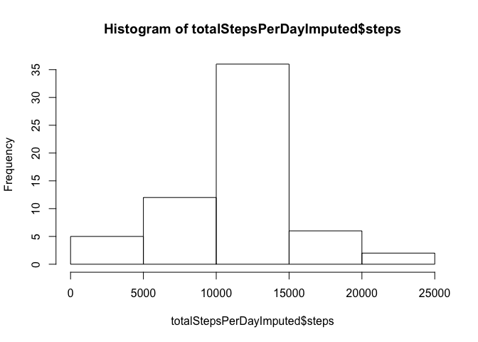

# Reproducible Research: Peer Assessment 1


## Loading and preprocessing the data
unzip and read data

```r
unzip("activity.zip")
activity <- read.csv("activity.csv")
```
transform date variable to date type

```r
activity$date <- as.Date(activity$date)
```
make dataset without NA

```r
activityNoNa <- activity[!is.na(activity$steps),]
```

## What is mean total number of steps taken per day?
Histogram of the total number of steps taken each day

```r
totalStepsPerDay <- aggregate(steps ~ date, data=activityNoNa, sum)
hist(totalStepsPerDay$steps)
```

<!-- -->

Mean and median number of steps taken each day

```r
summary(totalStepsPerDay$steps)[3:4]
```

```
## Median   Mean 
##  10760  10770
```

## What is the average daily activity pattern?
Calculate and plot average number of steps per 5-minute interval

```r
totalStepsPerInterval <- aggregate(steps ~ interval, data=activityNoNa, mean)
plot(totalStepsPerInterval$interval,totalStepsPerInterval$steps, type="l")
abline(v=totalStepsPerInterval$interval[which.max(totalStepsPerInterval$steps)], col="red")
```

<!-- -->

Which 5-minute interval, on average across all the days in the dataset, contains the maximum number of steps?

```r
totalStepsPerInterval$interval[which.max(totalStepsPerInterval$steps)]
```

```
## [1] 835
```

## Imputing missing values
Note that there are a number of days/intervals where there are missing values (coded as 𝙽𝙰). The presence of missing days may introduce bias into some calculations or summaries of the data.


Total number of filled (FALSE) and missing values (TRUE) in the dataset

```r
table(is.na(activity$steps))
```

```
## 
## FALSE  TRUE 
## 15264  2304
```

NA filling strategy for steps: NA's are filled with the mean of the steps per the interval.

```r
activityMerge <- merge(activity, totalStepsPerInterval, by="interval", sort=FALSE)
activityImputed <- activityMerge[,c("date", "interval")]
activityImputed$steps <- ifelse(is.na(activityMerge$steps.x), activityMerge$steps.y, activityMerge$steps.x)
```

Histogram of the total number of steps taken each day with NA's imputed

```r
totalStepsPerDayImputed <- aggregate(steps ~ date, data=activityImputed, sum)
hist(totalStepsPerDayImputed$steps)
```

<!-- -->

Mean and median number of steps taken each day with NA's imputed

```r
summary(totalStepsPerDayImputed$steps)[3:4]
```

```
## Median   Mean 
##  10770  10770
```

As result of imputing the missing valules with the mean of the interval, the median of steps per day increased. Also there is an increase of the number of days with 10000 to 15000 steps.

## Are there differences in activity patterns between weekdays and weekends?
Create a new factor variable in the dataset with two levels – “weekday” and “weekend” indicating whether a given date is a weekday or weekend day.

```r
library(lattice)
Sys.setlocale("LC_TIME","en_US.UTF-8")
```

```
## [1] "en_US.UTF-8"
```

```r
activityImputed$wday <- ifelse(weekdays(activityImputed$date) %in% c("Saturday","Sunday"),"weekend","weekday")
totalStepsPerWDayImputed <- aggregate(steps ~ interval +wday, data=activityImputed, mean)
xyplot(steps ~ interval | wday, data = totalStepsPerWDayImputed, type="l", layout=c(1,2))
```

<!-- -->
